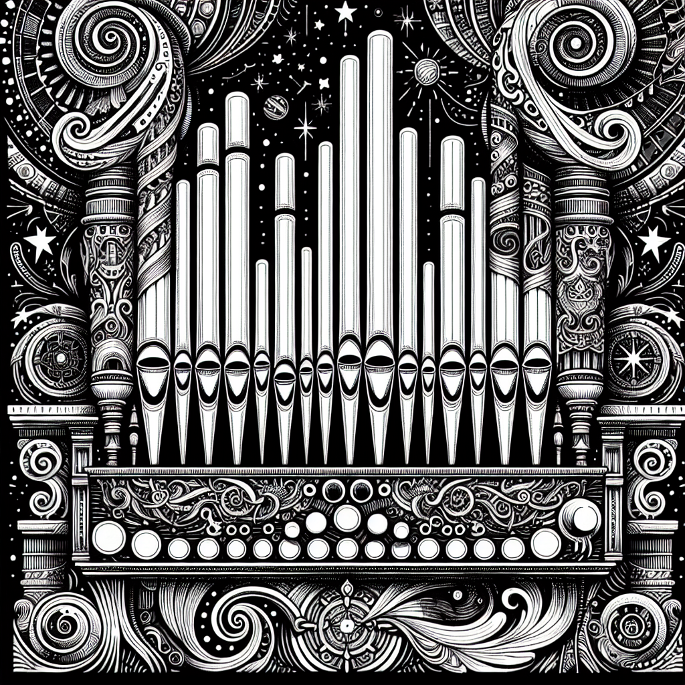

# Pad Generator Plugin

A [Signals & Sorcery](https://signalsandsorcery.com) plugin dedicated to pads — the scene's chord progression voiced as sustained washes that **rotate across 1–4 Surge XT patches** (bar 1 → patch A, bar 2 → patch B, …), so the texture never gets boring.

<p align="center">
  
</p>

> Part of the **[Signals & Sorcery](https://signalsandsorcery.com)** ecosystem.

## What it does

- **Patch rotation is the point**: pick 1–4 patches and the bars (or half-bars) cycle through them — the classic "toggle between pad sounds so nothing drones on" move, automated
- One schema-forced LLM call voices the chord progression with **smooth voice-leading** (hold common tones, move stepwise); a deterministic grid owns ALL timing, so generation is predictable and cheap
- **Duration modes**: `whole` (one sustained chord per bar), `half` (half-note chords rotating twice as fast), or `rhythmic` with a curated pattern set:

  | Pattern | Feel |
  |---------|------|
  | `play 1-2 · rest 3-4` | chord swell with a breath |
  | `rest 1-2 · play 3-4` | answering swell |
  | `pulsing quarters` | soft quarter-note pump |
  | `offbeat stabs` | skanky offbeat chords |
  | `long-short` | dotted push into the next bar |

- **Voicing control**: `full` (4–5 notes, root/3rd/7th plus a color tone) or `partial` (2–3 guide tones)
- **Rests control** (`off` / `sparse` / `half-bar`) composes with whole/half modes — sparse rests one bar in four *without* re-aligning the rotation
- A mid-bar chord change **splits and re-strikes** the pad so a stale chord is never held across a change
- A mechanical enforcement layer (not the LLM) guards register (C3–E5), snaps out-of-key tones to chord tones, caps polyphony, and fills any slot the model missed with a deterministic chord voicing — never a silent bar
- Each patch's Surge XT preset is chosen by role + register analysis (`Pads-Hi` / `Pads-Low` / `Drones`), with sibling sounds excluded so every patch in the cycle sounds distinct
- Regeneration reconciles the patch group and **never replaces a sound you picked**; per-patch 🎲 shuffle, sound history, FX chain, and piano-roll editing all work per track
- **Transition Designer support**: pad groups fade as one unit (verbatim copies — exact MIDI, presets, and FX) with a symmetric 0.5/0.5 crossing, because overlapping washes ARE the pad transition

## Install

From within Signals & Sorcery: **Settings > Manage Plugins > Add Plugin** and enter:

```
https://github.com/shiehn/sas-pad-plugin
```

Or clone manually into `~/.signals-and-sorcery/plugins/@signalsandsorcery/pad-generator/`.

## Capabilities

| Capability | Required |
|------------|----------|
| `requiresLLM` | Yes - AI chord voicing (one schema-forced call) |
| `requiresSurgeXT` | Yes - per-patch preset loading |

## Development

Built with the [@signalsandsorcery/plugin-sdk](https://github.com/shiehn/sas-plugin-sdk) — this panel is a thin adapter over the SDK's shared generator-panel core. See the [Plugin SDK docs](https://signalsandsorcery.com/plugin-sdk/) for the full API reference.

```bash
npm install
npm test        # grid + enforcement + reconcile + generation + transition suites
npm run build   # tsup → dist/
```

The grid (rotation, patterns, rests, chord-boundary splits) is pure and dependency-free in `src/pad-patterns.ts`; the register/polyphony/velocity constants live in `src/pad-enforce.ts` — tune them by ear.

## The Signals & Sorcery Ecosystem

- **[Signals & Sorcery](https://signalsandsorcery.com)** — the flagship AI music production workstation
- **[sas-plugin-sdk](https://github.com/shiehn/sas-plugin-sdk)** — TypeScript SDK for building generator plugins
- **[sas-synth-plugin](https://github.com/shiehn/sas-synth-plugin)** — AI-powered MIDI patterns with Surge XT synthesis
- **[sas-bass-plugin](https://github.com/shiehn/sas-bass-plugin)** — monophonic basslines mechanically partitioned across voice tracks
- **[sas-ensemble-plugin](https://github.com/shiehn/sas-ensemble-plugin)** — 2–6 jointly-composed counterpoint voices
- **[sas-arpeggiator-plugin](https://github.com/shiehn/sas-arpeggiator-plugin)** — one repeating cell expanded over the scene's chords
- **[sas-loops-plugin](https://github.com/shiehn/sas-loops-plugin)** — Audio loop / sample library browser with time-stretching
- **[sas-stems-plugin](https://github.com/shiehn/sas-stems-plugin)** — AI audio-from-text generation with stem splitting

<p align="center">
  <a href="https://signalsandsorcery.com">signalsandsorcery.com</a>
</p>

## License

MIT
